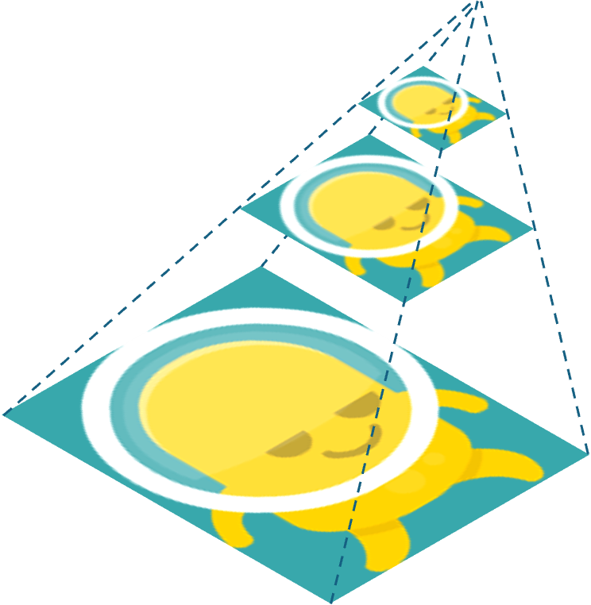

# Procgen Pyramid 

A collection of pre-compiled python wheels for the [Procgen benchmark](https://github.com/openai/procgen). The wheels can be downloaded from the [Release page](https://github.com/kaixin96/procgen-pyramid/releases).

## Linux

Currently supported Python versions: Python 3.7, 3.8, 3.9, 3.10

Currently supported resolutions: `224x224`

## Windows

Currently supported Python versions: Python 3.7, 3.8, 3.9, 3.10

Currently supported resolutions: `224x224`
